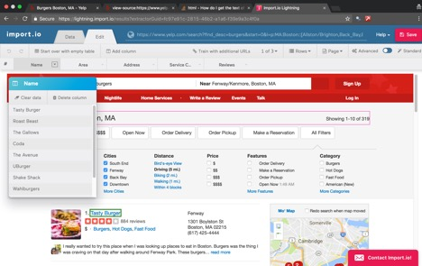

```{r setup, include=FALSE}
knitr::opts_chunk$set(echo = TRUE, message = FALSE, warning = FALSE)
```

<!-- Put here the link to your own homework repository -->
- GitHub: [NUDA5020/homework-khozem-lokhandwala](https://github.com/NUDA5020/homework-khozem-lokhandwala)

## Preparation

```{r}
library(tidyverse)
library(readxl)
library(stringr)
library(rvest)
library(RCurl)
```


#TASK A  

For the task assigned about webscraping data from yelp relating to burger restaurants around Boston area I chose to use **Import.io** as one of the toolkit which is readily available on the internet for download. The other scraper I used to extract the data is the **Rvest package** which required some manual coding. 
For this task I experimented with the following toolkits in total:  
**1. Import.io**  
**2. Data miner Recipe Creator**  
**3. Rvest Package combined with selector gadget**  

First, I explain the webscraping using the Rvest package combined with selector gadget.
The code below proceeds in the following sequence of operations:  
a. Reading the yelp url after filtering the results  
b. Using selector gadget identifying the html nodes that contain the data that we want to scrape and using those tags inside the html_nodes function to extract the corresponding content. The str\_trim and str\_replace\_all function has been used in the same code statement to clean up the extracted data of all the \\n tags.  
  

c. The above three steps are repeated for each type of text that we want to extract and similarly for each page of the yelp search result.  
d. Concatenate the corresponding character vectors from each page into one variable.  
e. Last step is to clean up the data in those columns in one standard format using stringr functions.  

CODE:
```{r}
burgerspg1 <- read_html("https://www.yelp.com/search?find_desc=burgers&start=0&l=p:MA:Boston::[Allston/Brighton,Back_Bay,Beacon_Hill,Downtown,Fenway,South_End,West_End]")
namespg1 <- burgerspg1 %>% html_nodes(".indexed-biz-name span") %>% html_text
areapg1 <- burgerspg1 %>% html_nodes(".natural-search-result .neighborhood-str-list") %>% html_text%>%str_trim%>%str_replace_all("[ \\n]+", " ")
addresspg1 <- burgerspg1 %>% html_nodes(".natural-search-result address") %>% html_text%>%str_trim%>%str_replace_all("[ \\n]+", " ")
servicecatpg1 <- burgerspg1 %>% html_nodes(".natural-search-result .price-category") %>% html_text%>%str_trim%>%str_replace_all("[ \\n]+", " ")
starspg1 <- burgerspg1 %>% html_nodes(".rating-large") %>% html_attr('title')%>%str_trim%>%str_replace_all("[ \\n]+", " ")
reviewspg1 <- burgerspg1 %>% html_nodes(".natural-search-result .rating-qualifier") %>% html_text %>%str_trim%>%str_replace_all("[ \\n]+", " ")

burgerspg2 <- read_html("https://www.yelp.com/search?find_desc=burgers&start=10&l=p:MA:Boston::[Allston/Brighton,Back_Bay,Beacon_Hill,Downtown,Fenway,South_End,West_End]")
namespg2 <- burgerspg2 %>% html_nodes(".indexed-biz-name span") %>% html_text
areapg2 <- burgerspg2 %>% html_nodes(".natural-search-result .neighborhood-str-list") %>% html_text%>%str_trim%>%str_replace_all("[ \\n]+", " ")
addresspg2 <- burgerspg2 %>% html_nodes(".natural-search-result address") %>% html_text%>%str_trim%>%str_replace_all("[ \\n]+", " ")
servicecatpg2 <- burgerspg2 %>% html_nodes(".natural-search-result .price-category") %>% html_text%>%str_trim%>%str_replace_all("[ \\n]+", " ")
starspg2 <- burgerspg2 %>% html_nodes(".rating-large") %>% html_attr('title')%>%str_trim%>%str_replace_all("[ \\n]+", " ")
reviewspg2 <- burgerspg2 %>% html_nodes(".natural-search-result .rating-qualifier") %>% html_text %>%str_trim%>%str_replace_all("[ \\n]+", " ")

burgerspg3 <- read_html("https://www.yelp.com/search?find_desc=burgers&start=20&l=p:MA:Boston::[Allston/Brighton,Back_Bay,Beacon_Hill,Downtown,Fenway,South_End,West_End]")
namespg3 <- burgerspg3 %>% html_nodes(".indexed-biz-name span") %>% html_text
areapg3 <- burgerspg3 %>% html_nodes(".natural-search-result .neighborhood-str-list") %>% html_text%>%str_trim%>%str_replace_all("[ \\n]+", " ")
addresspg3 <- burgerspg3 %>% html_nodes(".natural-search-result address") %>% html_text%>%str_trim%>%str_replace_all("[ \\n]+", " ")
servicecatpg3 <- burgerspg3 %>% html_nodes(".natural-search-result .price-category") %>% html_text%>%str_trim%>%str_replace_all("[ \\n]+", " ")
starspg3 <- burgerspg3 %>% html_nodes(".rating-large") %>% html_attr('title')%>%str_trim%>%str_replace_all("[ \\n]+", " ")
reviewspg3 <- burgerspg3 %>% html_nodes(".natural-search-result .rating-qualifier") %>% html_text %>%str_trim%>%str_replace_all("[ \\n]+", " ")

Name<- c(namespg1,namespg2,namespg3)
Neighbourhood<- c(areapg1,areapg2,areapg3)
Address<- c(addresspg1,addresspg2,addresspg3)
`Service Category`<- c(servicecatpg1,servicecatpg2,servicecatpg3)
Rating<- c(starspg1,starspg2,starspg3)
Reviews<- c(reviewspg1,reviewspg2,reviewspg3)
data<- data.frame(Name,Neighbourhood,Address,`Service Category`,Rating,Reviews)

data$Address<- str_replace_all(data$Address,c("\\sSt" = " St, ", "\\sAve" = " Ave, ","\\sSq"=" Sq, ","\\sPl"=" Pl, "))
data$Service.Category<- str_replace_all(data$Service.Category,"[$]+","")
data$Rating<- str_replace_all(data$Rating, "\\sstar rating","\\/5")
data$Reviews<- str_replace_all(data$Reviews,"\\sreviews","")
data
```

#TASK B
##PROCESS
Using Import.io all the data for 3 pages of yelp results were downloaded as a CSV file from its web interface and imported in R using read_excel. The process of webscraping through Import.io was relatively easier with no manual coding.   
The picture below shows the interface of Import.io that was used to select the data to be extracted.  



  


Both the data from Import.io as well as Recipe Creator is then imported into R using the read\_excel function.   

CODE:
```{r}
ImportIO_data<- read_excel("ImportIO result.xlsx")
ImportIO_data
dataminer<- read_csv("DataMiner.csv")
dataminer
Rvest_data <- data
Rvest_data
```

#TASK C
REPORT:  

##**COST**  
+ Import.io is a pricey webscraper with the basic essential version priced at \$299 and the others priced higher at \$1999 and \$4999.
+ Data miner tool is priced at \$19.99/month for its basic version and others at \$49/\$99/\$200 per month
+ Thus comparing costs it is obvious that Import.io is the cheaper option while the Rvest package is completely free of cost.

##**EASE OF USE**  
+ The interface of Import.io was more user friendly with select and drag layout. Adding/Removing columns and editing was much easier and intuitive in Import.io as compared to the Data miner interface.  The picture below shows how columns can be added and deleted simply using point and click GUI.  
     

+ The Data miner interface was slightly less user friendly and requires some kind of tutorial for kicking off.  
+ The Good about Data Miner was that there are ready made public recipes available which can be directly selected and the tool smartly recognizes the relevant data to scrape.  
   

+ The Data Miner was more convenient to use in a sense that it is a plugin for a browser and as you are browsing any site you can just slect the plguin and choose a recipe while for Import.io you need to go to its dashboard portal and then paste the links to the urls that we want to scrape.  
+ The manual coding done using the rvest package functions is something that cannot be done by a non-programmer and has no ease of use from an outside perspective.


##**FEATURES**  
+ The auto pagination feature of Data Miner tool was very useful for extracting the same data from multiple pages of the domain.   
 

+ For the same pagination functionality in Import.io the user has to manually copy paste the links to different pages in order for the tool to consider as shown below:  
 

+ Both Import.io and Data Miner allow adding manual Xpath for selectin hidden data elements which are not directly identified on the webpage.  
+ The manual coding done using the Rvest package functions provided deep functionality as to how you can scrape data and also clean up the data for better representation. The html_attr function is used to select certain attributes of the html nodes which provide great functionality.

##**RECOMMENDATION**  
+ There is no clear winner as to which the best web scraper is. Each webscraper tool is unique in its features. For this particular assignment I found the Import.io tool to be a more relevant automated toolkit simply based on their user interface.  
   

+ Though if you do not want specific data columns and are more interested in relevant data directly provided by the website the public recipes in Data Miner give you an added benefit.
+ I chose to manual code to web scrape the data using Rvest package since it is free of cost and has no restrictions on the data that you can extract. Thus manual coding gave me a complete data set of Burger restaurants in the BOSTON AREA.  
 

##**TASK D**
For the yelp page there is a standard format of the url it follows.  
The yelp website specific to Boston is given by https://www.yelp.com/boston  
When searching for Burgers in specific it responds with https://www.yelp.com/search?find_desc=burgers&find_loc=Boston%2C+MA&ns=1 where find_loc value   denotes the location searched for.  
The three URL's corresponding to the 3 pages of data are:    
1st Page: https://www.yelp.com/search?find_desc=burgers&start=0&l=p:MA:Boston::[Allston/Brighton,Back_Bay,Beacon_Hill,Downtown,Fenway,South_End,West_End]      

2nd Page:https://www.yelp.com/search?find_desc=burgers&start=10&l=p:MA:Boston::[Allston/Brighton,Back_Bay,Beacon_Hill,Downtown,Fenway,South_End,West_End]     

3rd Page: https://www.yelp.com/search?find_desc=burgers&start=20&l=p:MA:Boston::[Allston/Brighton,Back_Bay,Beacon_Hill,Downtown,Fenway,South_End,West_End]      

The only difference between the above three URL's are in the "start" value. start=0 represents the 1st page, start=10 represents 2nd page and start=30 represents 3rd page.  
The parameters that determine the search query are "find_desc" which represent the description provided by user, "start" parameter represents the page indicator and "l=p:" which indicates the location parameter.  

The parameter used for pagination on yelp pages is "start=#" where # represents the number of last result entry.  

The best guess for URL for the 7th page of Chinese restaurants in New York would be
https://www.yelp.com/search?find_desc=chinese&start=70&find_loc=New York%2C+NY